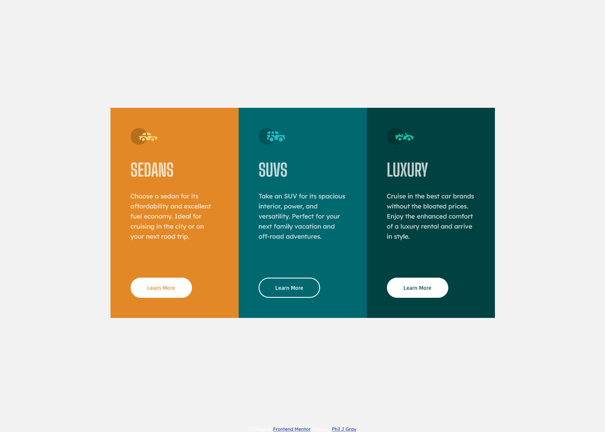
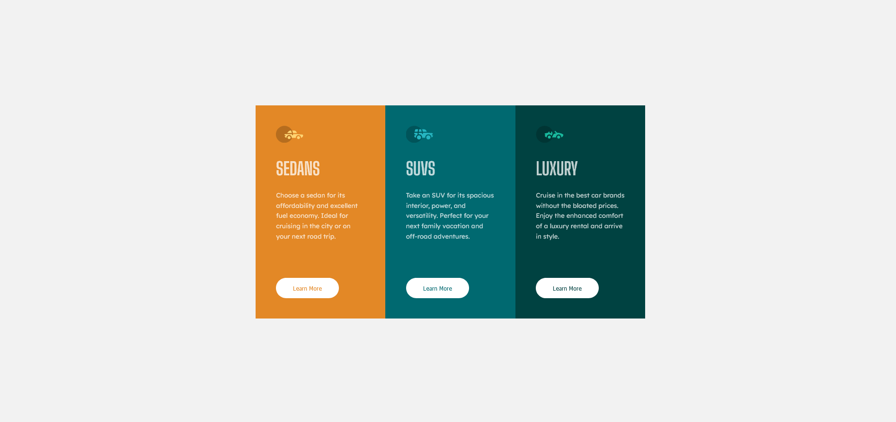
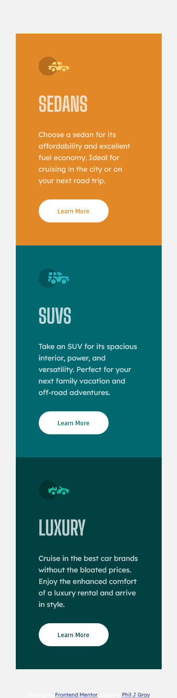

# Frontend Mentor - 3-column preview card component solution

This is a solution to the [3-column preview card component challenge on Frontend Mentor](https://www.frontendmentor.io/challenges/3column-preview-card-component-pH92eAR2-). Frontend Mentor challenges help you improve your coding skills by building realistic projects.

## Table of contents

- [Overview](#overview)
  - [The challenge](#the-challenge)
  - [Screenshot](#screenshot)
  - [Links](#links)
- [My process](#my-process)
  - [Built with](#built-with)
  - [What I learned](#what-i-learned)
  - [Continued development](#continued-development)
  - [Useful resources](#useful-resources)
- [Author](#author)
- [Acknowledgments](#acknowledgments)

**Note: Delete this note and update the table of contents based on what sections you keep.**

## Overview

I finished this project in around 4.5 to 5 hour sprint from start to finish. I focused heavily on making everything lining up as percisely as possible (hopefully it does). I also added a little extra css animation to the vehicle icons to make the project more dynamic.

### The challenge

### Screenshot

, , 

The icon animation does not appear in the screenshots.

### Links

- Solution URL: [Add solution URL here](https://your-solution-url.com)
- Live Site URL: [Add live site URL here](https://your-live-site-url.com)

## My process

### Built with

- Semantic HTML5 markup
- CSS custom properties
- Flexbox
- CSS Grid
- Mobile-first workflow
- CSS animation

### What I learned

Precision with the mockup
I learned how to better line up my project like the pictures provided. A very useful tool was puref for reviewing the screenshot next to the browser.

Sprint project
It was also good practice to see how quickly and efficiently I could complete a simple FEM project in one session.

Animated car icons
I added a little extra css animation to make the cars drive through the circle when hovered over. This was good practice working with the transition property and svg.

To see how you can add code snippets, see below:

```css
#vehicle__0,
#vehicle__1 {
  transition: all 1s ease;
}

#vehicle__0 {
  transform: translateX(-100%);

  opacity: 50;
}

svg:hover #vehicle__1 {
  transform: translateX(100%);
  opacity: 0;
}

svg:hover #vehicle__0 {
  transform: translateX(0%);
}

svg:hover #vehicle__1 {
  transform: translateX(100%);
  opacity: 0;
}
```

### Continued development

This sprint would have been even faster and more efficient if I had applied sass to the project. Next time I should familiarize myself with basic sass to speed up and organize my workflow better.

My original plan was to have the animation activate on a click to the learn more button. But I`m not quite that proficient at JS yet so I didn't bother here. I may update it in the future though.

### Useful resources

- [PureRef](https://www.pureref.com/) - This helped me for lining up the browser with the mockups. Its a must have for getting the dimension right without the sketch or figma.
- [SVG animation tutorial by Fireship](https://www.youtube.com/watch?v=UTHgr6NLeEw) - This was my original inspiration for adding the animation.

## Author

- Website - [Phil J Gray](https://www.philjgray.ca)
- Frontend Mentor - [@PhilJG](https://www.frontendmentor.io/profile/PhilJG)

## Acknowledgments

Thank you to the Fireship youtube channel! I leaned on their svg animation tutorial for writing this code. I would highly recommend it.
